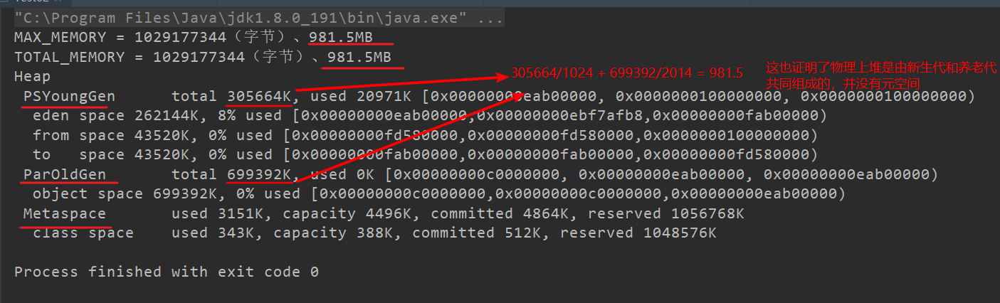

[TOC]


# JVM位置


JVM是运行在操作系统之上的，它与硬件没有直接的交互


# JVM体系结构


+ "灰色的地方"（Java栈、本地方法栈、程序计数器）**绝对不会有**垃圾回收
+ 所谓的JVM调优就是调`方法区和堆`，其中99%的情况下就是调`堆`


# 类装载器ClassLoader


负责加载class文件，class文件在文件开头有特定的文件标示，并且**ClassLoader只负责class文件的加载**，至于它是否可以运行，则由Execution Engine决定 


一个形象的类比：

+ Car.class：字节码文件，类模板，DNA元数据，类实例的样图；设计师纸上的模板
+ ClassLoader：快递员，只负责送货
+ Car Class：相当于是设计师电脑上的模板，元数据，是不能被改变的

## 类装载器种类（4种）

参考：https://www.cnblogs.com/fengbs/p/7595849.html


+ 虚拟机自带的加载器
  + 启动类加载器（Bootstrap）C++；**注意：我们根本拿不到他的引用，但是他实际存在，并且加载一些java的核心类**
  + 扩展类加载器（Extension）Java
  + 应用程序类加载器（App）Java也叫系统类加载器，加载当前应用的classpath的所有类

+ 用户自定义加载器  Java.lang.ClassLoader的子类，用户可以定制类的加载方式

例如：

```java
public class Test01 {

    public static void main(String[] args) {
        Object o1 = new Object();  // 系统自带类

        System.out.println(o1.getClass().getClassLoader());  // Object是在启动类加载器（根加载器）加载的，但是我们拿不到它的引用，返回null

        Person p1 = new Person();   // 自定义类
        System.out.println(p1.getClass().getClassLoader());  // sun.misc.Launcher$AppClassLoader@18b4aac2  应用程序类加载器
        System.out.println(p1.getClass().getClassLoader().getParent());  // sun.misc.Launcher$ExtClassLoader@7f31245a  扩展类加载器
        System.out.println(p1.getClass().getClassLoader().getParent().getParent());  // null  启动类加载器（根加载器）
    }


}

@Data
class Person{
    private String name;
    private String age;
}
```


## 双亲委派和沙箱安全机制

+ `sun.misc.Launcher`它是一个java虚拟机的入口应用
+ 双亲委派：某个特定的类加载器在接到加载类的请求时，首先将加载任务委托给父类加载器，依次递归，如果父类加载器可以完成类加载任务，就成功返回；只有父类加载器无法完成此加载任务时，才自己去加载
  + 所以当你自定义一个`java.lang.String`类时，依据双亲委派机制，JVM会先加载`启动类加载器`里的`java.lang.String`，也就是系统自带的String类，这样会导致你的String类无法生效。
  + 一定程度上防止了外部代码对JVM的污染


# Execution Engine执行引擎负责解释命令，提交操作系统执行


# Native


+ 多线程和语言无关和操作系统有关

+ native：俗称`本地方法`，意味着java的势力范围只能到这了，底层只能通过JVM的`JNI`技术来调用底层操作系统的额外的第三方函数库来完成了
  + `JNI`：`Java Native Interface`，java本地接口


+ 带`native`关键字的方法：到`本地方法栈(Native Method Stack)`
+ 不带`native`的正常方法：到`Java栈(Java Stack)`


## Native Interface本地接口

Java语言本身不能对操作系统底层进行访问和操作，但是可以通过JNI接口调用其他语言来实现对底层的访问。

本地接口的作用是融合不同的编程语言为Java所用，它的初衷是融合 C/C++程序，Java诞生的时候是C/C++横行的时候，要想立足，必须有调用C/C++程序，于是就在内存中专门开辟了一块区域处理标记为Native的代码，它的具体做法是Native Method Stack中登记Native方法，在Execution Engine 执行时加载Native libraries。

目前该方法使用的越来越少了，除非是与硬件有关的应用，比如通过Java程序驱动打印机或者Java系统管理生产设备，在企业级应用中已经比较少见。因为现在的异构领域间的通信很发达，比如可以使用Socket通信，也可以使用WebService等等，不多做介绍

## Native Method Stack

它的具体做法是Native Method Stack中登记native方法，在Execution Engine执行时加载本地方法库


# PC寄存器


+ `程序计数器`不做存储，做计数和调度
+ 记录了程序加载、调度的执行顺序
+ **每个线程都有一个程序计数器**，是线程私有的,就是一个指针，指向方法区中的方法字节码（用来存储指向下一条指令的地址,也即将要执行的指令代码），由执行引擎读取下一条指令，是一个非常小的内存空间，几乎可以忽略不记


# 方法区


+ **方法区是保存类信息、DNA元数据信息的一个模板区**
+ 只要是线程私有的、独享的一律没有优化和回收；只要是被所有线程共享的则有优化有回收

+ 方法区是被所有线程共享，所有字段和方法字节码，以及一些特殊方法如构造函数，接口代码也在此定义。简单说，所有定义的方法的信息都保存在该区域，此区属于共享区间。
+ **静态变量+常量+类信息（构造方法/接口定义）+运行时常量池存在方法区中**
+ 但是！**实例变量存在堆内存中，和方法区无关**


# 栈

+ 栈管运行；栈里面装的是我们日常运行的方法
+ `main`方法在栈的最底下
+ 栈也叫栈内存，主管Java程序的运行，是在线程创建时创建，它的生命期是跟随线程的生命期，线程结束栈内存也就释放，**对于栈来说不存在垃圾回收问题**，只要线程一结束该栈就Over，生命周期和线程一致，是线程私有的。**8种基本类型的变量+对象的引用变量+实例方法都是在函数的栈内存中分配**
+ 栈帧中主要保存3类数据：
  + 本地变量（Local Variables）：输入参数和输出参数以及方法内的变量
  + 栈操作（Operand Stack）：记录出栈、入栈的操作
  + 栈帧数据（Frame Data）：包括类文件、方法等等（方法压到栈里面后就叫做栈帧）
+ `Exception in thread "main" java.lang.StackOverflowError`栈内存溢出异常


## 栈运行的原理

栈中的数据都是以栈帧（Stack Frame）的格式存在，栈帧是一个内存区块，是一个数据集，是一个有关方法（Method）和运行期数据的数据集，当一个方法A被调用时就产生了一个栈帧F1，并被压入到栈中，A方法又调用了B方法，于是产生栈帧F2也被压入栈，B方法又调用了C方法，于是产生栈帧F3也被压入栈……

执行完毕后，先弹出F3栈帧，再弹出F2栈帧，再弹出F1栈帧……
遵循“先进后出”/“后进先出”原则


上图所示在一个栈中有两个栈帧：

+ 栈帧2是最先被调用的方法，先入栈
+ 然后方法2又调用了方法1，栈帧1处于栈顶的位置
+ 栈帧2处于栈底，执行完毕后，依次弹出栈帧1和栈帧2
+ 线程结束，栈释放。
+ 每执行一个方法都会产生一个栈帧，保存到栈（后进先出）的**顶部**，**顶部栈就是当前的方法，该方法执行完毕后会自动将此栈帧出栈**


## 栈帧所包含的结构


## 栈+堆+方法区的交互关系


+ HotSpot是使用指针的方式来访问对象（HotSpot可以看作是JVM的一种实现技术）
+ Java堆中会存放访问类元数据的地址
+ reference存储的就直接是对象的地址

+ 上图中`reference`代表的是引用类型如`Person p1 = new Person()`
+ 引用指向堆中的对象实例，对象实例又指向方法区的对象类型数据，对象类型数据（DNA元数据）可以保证每个对象类型一致


# 堆

一个JVM实例只存在一个堆内存，堆内存的大小是可以调节的
类加载器读取了类文件后，需要把类、方法、常变量放到堆内存中，保存所有引用类型的真实信息，以方便执行器执行，堆内存分为三部分：

+ `新生区`：Young Generation Space、Young/New
+ `养老区`：Tenure generation space、Old/Tenure
+ `永久区`：Permanent Space、Perm

## java7之前的堆

一个JVM实例只存在一个堆内存，堆内存的大小是可以调节的。类加载器读取了类文件后，需要把类、方法、常变量放到堆内存中，保存所有引用类型的真实信息，以方便执行器执行
堆内存**逻辑上（逻辑结构）**分为三部分：新生+养老+永久


### 新生区

新生区是类的诞生、成长、消亡的区域，一个类在这里产生，应用，最后被垃圾回收器收集，结束生命。新生区又分为两部分： `伊甸区（Eden space）`和`幸存者区（Survivor pace）` ，所有的类都是在伊甸区被new出来的。`幸存区有两个： 0区（Survivor 0 space）和1区（Survivor 1 space）`。当伊甸园的空间用完时，程序又需要创建对象，JVM的垃圾回收器将对伊甸园区进行垃圾回收`(Minor GC)（又称轻GC）`，将伊甸园区中的不再被其他对象所引用的对象进行销毁。然后将伊甸园中的剩余对象移动到幸存0区.若幸存0区也满了，再对该区进行垃圾回收，然后移动到1区。那如果1区也满了呢？（**注：实际上这里又会先移到0区，往复交替`15次`后如果该对象还存活下来才会被移到养老区**）再移动到养老区。若养老区也满了，那么这个时候将产生`MajorGC（FullGC）（又称重GC）`，进行养老区的内存清理。若养老区执行了Full GC之后发现依然无法进行对象的保存，就会产生OOM异常“OutOfMemoryError”

如果出现`java.lang.OutOfMemoryError: Java heap space`异常，说明Java虚拟机的堆内存不够。原因有二：

+ Java虚拟机的堆内存设置不够，可以通过参数-Xms、-Xmx来调整
+ 代码中创建了大量大对象，并且长时间不能被垃圾收集器收集（存在被引用）


### 永久区

永久存储区是一个**常驻内存区域**，用于存放JDK自身所携带的Class，Interface的**元数据**，也就是说**它存储的是运行环境必须的类信息（比如Java的Object类、String类又或者是JDBC的jar包等等）**，被装载进此区域的数据是不会被垃圾回收器回收掉的，关闭JVM才会释放此区域所占用的内存

如果**执行完一次Full GC后**出现`java.lang.0utOfMemoryError:PermGen space`，说明是Java虚拟机对永久代Perm内存设置不够。一般出现这种情况，都是程序启动需要加载大量的第三方jar包。例如：在一个Tomcat下部署了太多的应用。或者大量动态反射生成的类不断被加载，最终导致`Perm区被占满`

+ Jdk1.6及之前：有永久代，常量池1.6在方法区
+ Jdk1.7：有永久代，但已经逐步“去永久代”，常量池1.7在堆
+ Jdk1.8及之后：**无永久代**，常量池1.8在元空间
  + 元空间与永久代之间最大的区别在于：元空间并不在虚拟机中，而是使用本地内存


## java8的堆

基本结构差不多，但是是`新生+养老+元空间`，就是把java7的永久存储区换成了元空间

99%的对象会在新生区的伊甸园区生老病死（即new出来在这里，被垃圾回收也在这里）


## Sun HotSpot内存管理


+ 从该图可以看出，堆**逻辑上**三块（新生+养老+永久）；**物理上**两块（新生+养老）
+ 所以永久代**物理上**不属于堆空间
+ 不同对象的生命周期不同，98%的对象是临时对象
+ `java.lang.OutOfMemoryError: Java heap space`异常只算Heap区溢出异常，所以从上图可以知道，该异常算的是（新生+养老）区溢出的异常
+ 新生代（New/Young）：由Eden、两块相同大小的Survivor（又称from/to，s0/s1）构成，to总为空
+ 养老区（Old）：存放新生代中经历多次GC仍然存活的对象


## 方法区和永久代的关系

+ 实际而言，方法区（Method Area）和堆一样，是各个线程共享的内存区域，它用于存储虚拟机加载的：类信息+普通常量+静态常量+编译器编译后的代码等等，虽然**JVM规范将方法区描述为堆的一个逻辑部分，但它却还有一个别名叫做`Non-Heap（非堆）`，目的就是要和堆分开**
+ 对于HotSpot虚拟机，很多开发者习惯将方法区称之为“永久代Parmanent Gen）”，但严格本质上说两者不同，或者说使用永久代来实现方法区而已，**永久代是方法区（相当于是一个接口interface）的一个实现**，jdk1.7的版本中，已经将原本放在永久代的字符串常量池移走放进堆中；jdk1.8则又将其放在元空间中
  + 永久代就是方法区的一种落地实现，所以开发人员有时将方法区称为永久代
+ 常量池（Constant Pool）是方法区的一部分，Class文件除了有类的版本、字段、方法、接口等描述信息外，还有一项信息就是常量池，这部分内容将在类加载后进入方法区的运行时常量池中存放


# 堆内存调优

## java7


## java8

JDK 1.8之后将最初的永久代取消了，由元空间取代


## 调优


```java
public static void main(String[] args){
    long maxMemory = Runtime.getRuntime().maxMemory() ;//返回 Java 虚拟机试图使用的最大内存量。
    long totalMemory = Runtime.getRuntime().totalMemory() ;//返回 Java 虚拟机中的内存总量。
    System.out.println("MAX_MEMORY = " + maxMemory + "（字节）、" + (maxMemory / (double)1024 / 1024) + "MB");
    System.out.println("TOTAL_MEMORY = " + totalMemory + "（字节）、" + (totalMemory / (double)1024 / 1024) + "MB");
}
```

我们发现默认的情况下分配的内存是总内存的“1 / 4”、而初始化的内存为“1 / 64”：


调节JVM参数：

```
VM参数：	-Xms1024m -Xmx1024m -XX:+PrintGCDetails
```

调完之后再运行得到：




再来：

```java
String str = "www.atguigu.com" ;
while(true) 
{
    str += str + new Random().nextInt(88888888) + new Random().nextInt(999999999) ;
}
```

调节VM参数：

```
VM参数：-Xms8m -Xmx8m -XX:+PrintGCDetails
```

结果：


# 学会使用IDEA的内存分析工具

原视频讲解的是Eclipse的工具，略过

自己去找IDEA的相关工具学习


# GC


+ GC：分代收集算法
  + 次数上频繁收集Young区
  + 次数上较少收集Old区
  + 基本不动Perm区

##  GC算法总体概述


+ JVM在进行GC时，并非每次都对上面三个内存区域一起回收的，大部分时候回收的都是指新生代（伊甸园区）
+ 因此GC按照回收的区域又分了两种类型，一种是普通GC（minor GC），一种是全局GC（major GC or Full GC）
  + 普通GC（minor GC）：只针对新生代区域的GC
  + 全局GC（major GC or FullGC）：针对年老代的GC，偶尔伴随对新生代的GC以及对永久代的GC


## GC垃圾回收算法

### 引用计数法

+ 了解，因为现在没人用

+ 因为其无法解决`循环引用`的问题


### 复制算法（Copying）

+ 复制算法很重要
+ **年轻代**中使用的是Minor GC，这种GC算法采用的是复制算法（Copying）
  + 因为**年轻代（伊甸园区）**对象朝生夕死，new出来的对象死的多活的少，只复制活的那些

+ Minor GC会把Eden中的所有活的对象都移到Survivor区域中，如果Survivor区中放不下，那么剩下的活的对象就被移到Old generation中，也即一旦收集后，Eden是就变成空的了（**也就是Minor GC轻GC结束后，伊甸园区为空**）
+ 当对象在Eden（包括一个Survivor区域，这里假设是from区域）出生后，在经过一次Minor GC后，如果对象还存活，并且能够被另外一块Survivor区域所容纳（上面已经假设为from区域，这里应为to区域，即to区域有足够的内存空间来存储Eden 和from区域中存活的对象），则使用`复制算法`将这些仍然还存活的对象复制到另外一块 Survivor区域（即to区域）中，然后清理所使用过的Eden 以及Survivor区域（即from区域），并且将这些对象的年龄设置为1，以后对象在Survivor区每熬过一次Minor GC，就将对象的年龄+1，当对象的年龄达到某个值时（默认是`15岁`，通过`-XX:MaxTenuringThreshold`来设定参数），这些对象就会成为老年代
  + `-XX:MaxTenuringThreshold`设置对象新生代中存活的次数
+ 年轻代中的GC主要是复制算法（Copying）
  + 优点：不会产生内存碎片、速度快
  + 缺点：占空间，浪费了一倍的内存空间
+ HotSpot JVM把年轻代分为了三部分：1个Eden区和2个Survivor区（分别叫from和to）。**默认比例为8：1：1**，一般情况下，新创建的对象都会被分配到Eden区（一些大对象特殊处理），这些对象经过第一次Minor GC后，如果仍然存活，将会被移到Survivor区。对象在Survivor区中每熬过一次Minor GC，年龄就会增加1岁，当它的年龄增加到一定程度时，就会被移动到年老代中。因为年轻代中的对象基本都是朝生夕死的（90%以上），所以在**年轻代的垃圾回收算法使用的是复制算法**，复制算法的基本思想就是将内存分为两块（这两块指的是from和to区），每次只用其中一块，当这一块内存用完，就将还活着的对象复制到另外一块上面。复制算法不会产生内存碎片


+ 在GC开始的时候，对象只会存在于Eden区和名为“From”的Survivor区，Survivor区“To”是空的。紧接着进行GC，Eden区中所有存活的对象都会被复制到“To”，而在“From”区中，仍存活的对象会根据他们的年龄值来决定去向。年龄达到一定值（年龄阀值，可以通过`-XX:MaxTenuringThreshold`来设置）的对象会被移动到年老代中，没有达到阈值的对象会被复制到“To”区域。**经过这次GC后，Eden区和From区已经被清空。这个时候，“From”和“To”会交换他们的角色，也就是新的“To”就是上次GC前的“From”，新的“From”就是上次GC前的“To”**。不管怎样，都会保证名为To的Survivor区域是空的。Minor GC会一直重复这样的过程，直到“To”区被填满，**“To”区被填满之后，会将所有对象移动到年老代中**
  + 复制之后有交换，谁空谁是`To`


+ 因为Eden区对象一般存活率较低，一般的，使用两块10%的内存作为空闲（To区）和活动区间（From区），而另外80%的内存（伊甸园区），则是用来给新建对象分配内存的。一旦发生GC，将10%的from活动区间与另外80%中存活的eden对象转移到10%的to空闲区间，接下来，将之前90%的内存全部释放，以此类推

+ 复制算法它的缺点也是相当明显的：
  + 它浪费了一半的内存，这太要命了
  + 如果对象的存活率很高，我们可以极端一点，假设是100%存活，那么我们需要将所有对象都复制一遍，并将所有引用地址重置一遍。复制这一工作所花费的时间，在对象存活率达到一定程度时，将会变的不可忽视。所以从以上描述不难看出，复制算法要想使用，**最起码对象的存活率要非常低才行**，而且最重要的是，我们必须要克服50%内存的浪费

### 标记清除（Mark-Sweep）

+ 有点像`精确打击，定点清除`
+ 优点：不需要额外空间
+ 缺点：会产生内存碎片；两次扫描，耗费时间
+ **老年代**一般是由标记清除或者是标记清除与标记整理的混合实现
  + 标记清除算法一般用于老年代


+ 当堆中的有效内存空间（available memory）被耗尽的时候，就会停止整个程序（也被称为stop the world），然后进行两项工作，第一项则是`标记`，第二项则是`清除`
  + 标记：从引用根节点开始标记所有被引用的对象。标记的过程其实就是遍历所有的GC Roots，然后将所有GC Roots可达的对象**标记为存活的对象**
  + 清除：遍历整个堆，**把未标记的对象清除**
+ 缺点：此算法需要暂停整个应用，会产生内存碎片
+ 用通俗的话解释一下标记/清除算法，就是当程序运行期间，若可以使用的内存被耗尽的时候，GC线程就会被触发并将程序暂停，随后将依旧存活的对象标记一遍，最终再将堆中所有没被标记的对象全部清除掉，接下来便让程序恢复运行
+ 标记清除算法的劣势：
    + 首先，它的缺点就是效率比较低（递归与全堆对象遍历），而且在进行GC的时候，需要停止应用程序，这会导致用户体验非常差劲
    + 其次，主要的缺点则是这种方式清理出来的**空闲内存是不连续**的，这点不难理解，我们的死亡对象都是随即的出现在内存的各个角落的，现在把它们清除之后，内存的布局自然会乱七八糟。而为了应付这一点，JVM就不得不维持一个内存的空闲列表，这又是一种开销。而且在分配数组对象的时候，寻找连续的内存空间会不太好找

### 标记压缩（Mark-Compact）

+ 老年代一般是由标记清除或者是标记清除与标记整理的混合实现
  + 所以标记压缩也是用于老年代
+ 在整理压缩阶段，不再对标记的对像做回收，而是通过所有存活对象都向一端移动，然后直接清除边界以外的内存。可以看到，标记的存活对象将会被整理，按照内存地址依次排列，而未被标记的内存会被清理掉。如此一来，当我们需要给新对象分配内存时，JVM只需要持有一个内存的起始地址即可，这比维护一个空闲列表显然少了许多开销
+ 标记/整理算法不仅可以弥补标记/清除算法当中，内存区域分散的缺点，也消除了复制算法当中，内存减半的高额代价


### 标记清除压缩（Mark-Sweep-Compact）


## 小总结

+ 内存效率：复制算法>标记清除算法>标记整理算法（此处的效率只是简单的对比时间复杂度，实际情况不一定如此）
+ 内存整齐度：复制算法=标记整理算法>标记清除算法
+ 内存利用率：标记整理算法=标记清除算法>复制算法
+ 可以看出，效率上来说，复制算法是当之无愧的老大，但是却浪费了太多内存，而为了尽量兼顾上面所提到的三个指标，标记/整理算法相对来说更平滑一些，但效率上依然不尽如人意，它比复制算法多了一个标记的阶段，又比标记/清除多了一个整理内存的过程


## 分代收集算法

+ 没有最好的算法，只有最合适的算法=>分代收集算法

+ 年轻代（Young Gen）
  + 年轻代特点是区域相对老年代较小，对象存活率低
  + 这种情况复制算法的回收整理，速度是最快的。复制算法的效率只和当前存活对象大小有关，因而很适用于年轻代的回收。而复制算法内存利用率不高的问题，通过hotspot中的两个survivor的设计得到缓解
+ 老年代（Tenure Gen）
  + 老年代的特点是区域较大，对象存活率高
  + 这种情况，存在大量存活率高的对象，复制算法明显变得不合适。一般是由标记清除或者是标记清除与标记整理的混合实现
+ Mark阶段的开销与存活对象的数量成正比，这点上说来，对于老年代，标记清除或者标记整理有一些不符，但可以通过多核/线程利用，对并发、并行的形式提标记效率
+ Sweep阶段的开销与所管理区域的大小形正相关，但Sweep“就地处决”的特点，回收的过程没有对象的移动。使其相对其它有对象移动步骤的回收算法，仍然是效率最好的。但是需要解决内存碎片问题
+ Compact阶段的开销与存活对象的数据成开比，如上一条所描述，对于大量对象的移动是很大开销的，做为老年代的第一选择并不合适
+ 基于上面的考虑，**老年代一般是由标记清除或者是标记清除与标记整理的混合实现**。以hotspot中的CMS回收器为例，CMS是基于Mark-Sweep实现的，对于对象的回收效率很高，而对于碎片问题，CMS采用基于Mark-Compact算法的Serial Old回收器做为补偿措施：当内存回收不佳（碎片导致的Concurrent Mode Failure时），将采用Serial old执行Full GC以达到对老年代内存的整理


# 几道面试题

小试牛刀：

